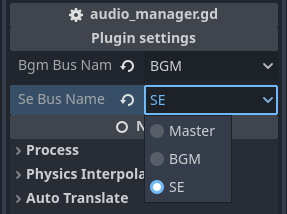

# Godot Audio Manager


A small godot plugin to manage easily audio playing, for Godot 4.x.

## 📦 Installation
1. Download the plugin as zip file
2. Unzip the file in your Godot project folder, so you have a `addons/godot-audio-manager` folder
3. Enable this plugin within the Godot editor settings in `Project -> Project Settings -> Plugins

When this plugin is enabled, it automatically activates an `AudioManager` singleton, which you can use to play music and sound effects.

## Configuration
This audio manager let you play music and sound effects on their own audio buses. By default, they are both set to the "Master" bus, but you can change this in the `AudioManager` node properties, in the `addons/godot-audio-manager/audio_manager.tscn` scene.

<p align="center">
  
</p>

## Basic Usage
```gdscript
var stream:AudioStream = preload("my_awesome_audio.ogg")

# To play a music
AudioManager.play_music(stream)

# To play a sound effect
AudioManager.play_sound_effect(stream)

# To abruptly stop the music
AudioManager.stop_music()
# To fade out the music
AudioManager.fade_out_music(1.0) # 1 second fade out
```
